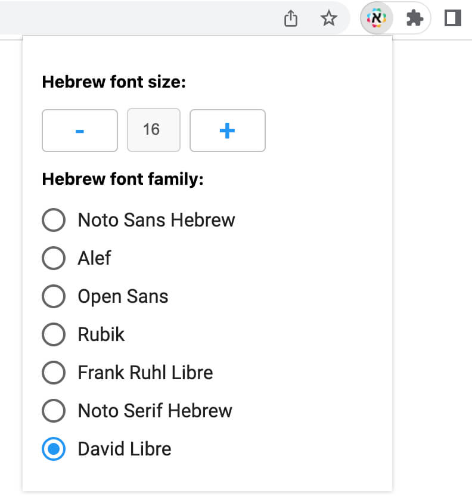

# Hebrew support for Slack. RTL. Chrome extension

1. Built on HTML, CSS and JavaScript.
2. Works in all Chromium browsers.
3. This plugin adds full Hebrew support to the Slack web version.
   Features:

- The direction of the letter in the message from right to left (only for messages with Hebrew symbols)
- The direction of the letter when writing, when entering Hebrew symbols
- Changes the direction of the Slack interface for Hebrew messages (avatar, date, message functions etc.)
- Supports formatted messages: lists, bold text, links, quotes, code, etc.
- Selecting from 7 Google fonts to customise Hebrew font family in your Slack text.
- Customise Hebrew font size.

## Screenshots

 

 

 

## Quick Start

1. Install from Chrome Web Store [hebrew-support-for-slack](https://chrome.google.com/webstore/detail/hebrew-support-for-slack/hikbibjgneeklkchmeaffbeghcnbdcfl).
2. Go to Slack tab.
3. To change the font family and font size: click on the extension icon.
4. Enjoy!

## Browser Support

Latest stable versions of Chrome, Brave, and other Chromium based modern browsers.

---

Licensed under [MIT License](LICENSE).
